# Untitled

[1. Prerrequisitos 3]()

[2. Instalación de ASMS 3]()

[3. Conexión a la base de datos 6]()

<table>
  <thead>
    <tr>
      <th style="text-align:left"><b>CONTROL DE CAMBIOS</b>
      </th>
      <th style="text-align:left"></th>
    </tr>
  </thead>
  <tbody>
    <tr>
      <td style="text-align:left">
        
<b>Aranda Service Management Suite</b>
        

        
<b>Gu&#xED;a de instalaci&#xF3;n</b>
        

      </td>
      <td style="text-align:left"></td>
    </tr>
    <tr>
      <td style="text-align:left">Fecha de Creaci&#xF3;n</td>
      <td style="text-align:left">Marzo 12 de 2021</td>
    </tr>
    <tr>
      <td style="text-align:left">Versi&#xF3;n</td>
      <td style="text-align:left">1</td>
    </tr>
  </tbody>
</table>

## Prerrequisitos

Antes de iniciar la instalación de Aranda Service Management Suite es necesario crear el esquema de base de datos a través del módulo **Aranda Database Tools v9**.

Consulte el manual de usuario de **Aranda Database Tools v9** en el siguiente enlace:

[https://arandasoft.com/manuals/wp-content/uploads/2020/09/v2-manual-adbt-para-v9.pdf](https://arandasoft.com/manuals/wp-content/uploads/2020/09/v2-manual-adbt-para-v9.pdf).

1. 
## Instalación de ASMS

El instalador **Aranda.ASMS.Installer** instala cuatro sitios web \(ASMSAdministrator, ASMSSpecialist, ASMSCustomer y ASMSAPI\) y cuatro servicios \(Aranda License Windows Service, Aranda Mailer Windows Service V9, Aranda Scheduler Windows Service y Aranda Worker Windows Service\).

Haga doble clic sobre el archivo del instalador y visualizará la pantalla de bienvenida.

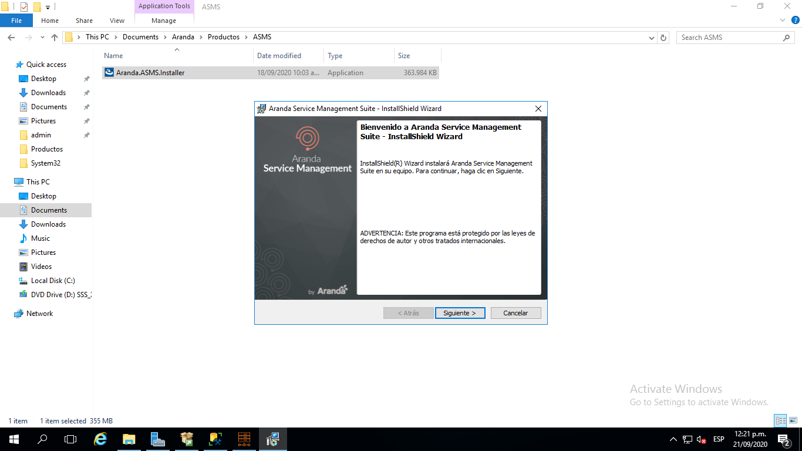

Confirme la instalación haciendo clic en el botón **Siguiente.**

En la pantalla **Información del cliente**, ingrese el nombre de usuario, la organización y haga clic en **Siguiente**.

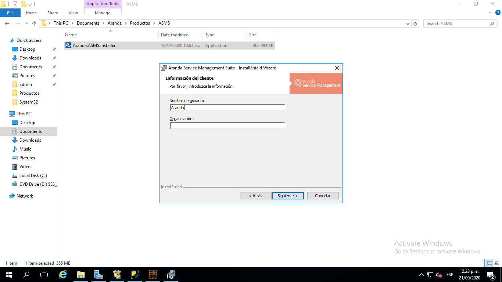

Elija el tipo de instalación, las opciones son:

* **Completa**: se instalarán todos los sitios y servicios en las rutas por defecto.
* **Personalizada**: podrá cambiar la ruta de instalación de los sitios web y los servicios.

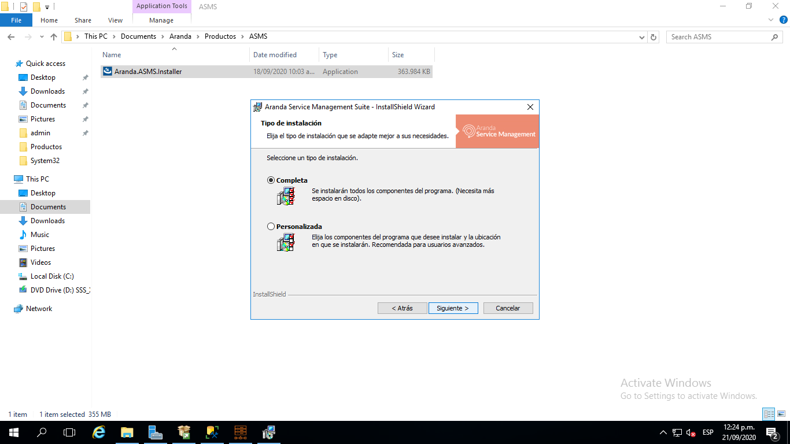

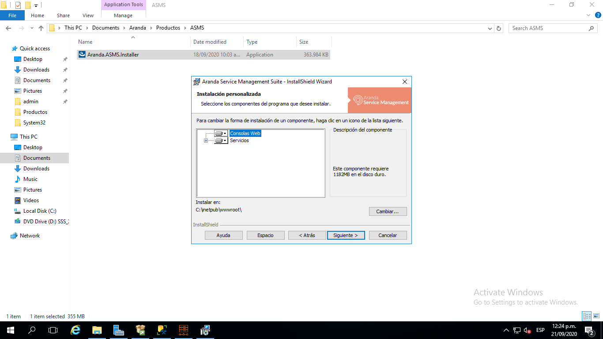

Una vez configurado el tipo de instalación haga clic en **Siguiente** y luego haga clic en el botón **Instalar.**

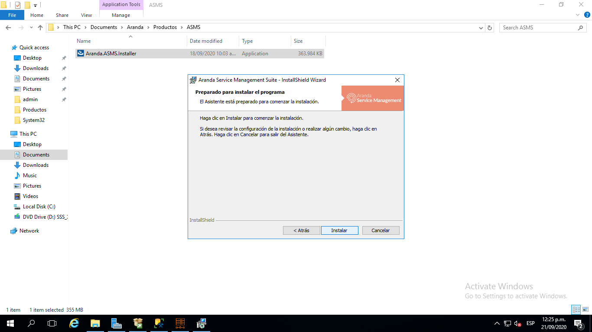

Cuando el proceso de instalación finalice, haga clic en el botón **Finalizar.**

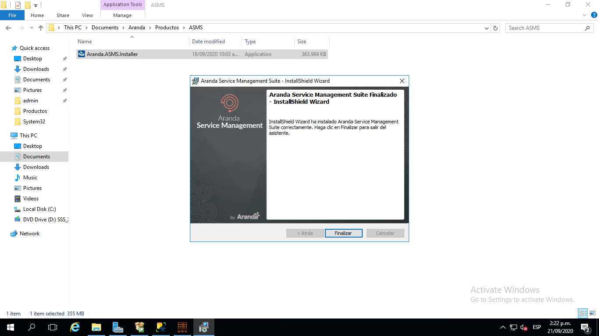

## Conexión a la base de datos

Una vez finalice la instalación de **Aranda Service Management Suite**, proceda a configurar las cadenas de conexión de los sitios y servicios hacia la base de datos a través del módulo **Aranda Database Tools v9**. Para ello, ejecute el módulo y haga clic en la pestaña **Connection String**.

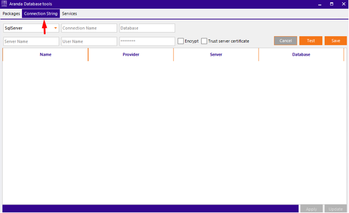

Complete los datos solicitados.

* Seleccione el motor de base de datos \(SqlServer u Oracle\).
* Asigne un nombre para identificar la conexión.
* Registre los datos de conexión \(nombre de la base de datos o TNS, nombre del servidor o dirección IP, y si se requiere usuario y contraseña\).

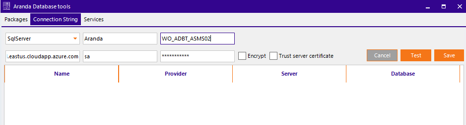

Haga clic en el botón **Test** para comprobar la conexión.

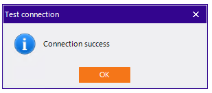

Finalmente haga clic en el botón **Save** para guardar la conexión.

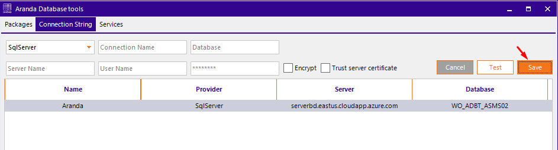

Para aplicar las cadenas de conexión a las aplicaciones instaladas, seleccione la conexión creada previamente y haga clic en el botón **Apply.**

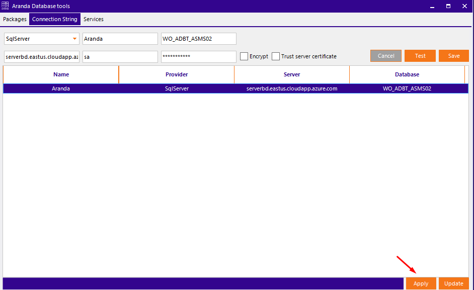

Se abrirá una ventana con el listado de aplicaciones y servicios disponibles en el servidor.

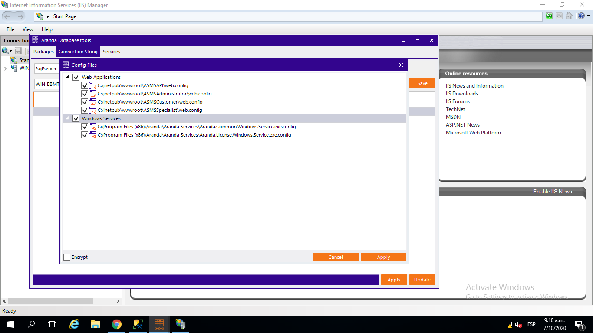

Seleccione todos los sitios web y servicios correspondientes a ASMS y haga clic en el botón **Apply,** si desea encriptar la conexión marque la casilla **Encrypt** ubicada en la esquina inferior izquierda.

Finalmente haga clic en la pestaña **Services** e inicie todos los servicios.

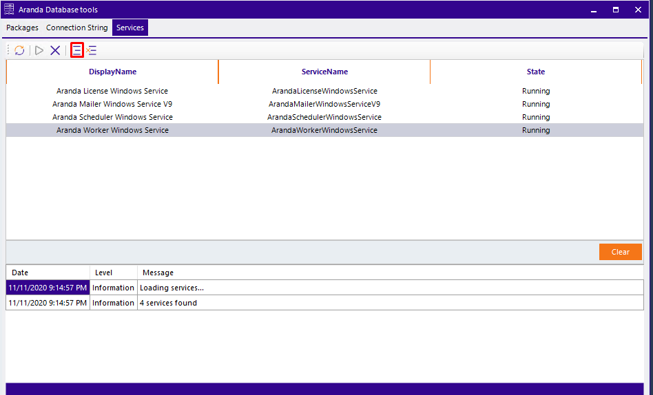

Una vez finalizada la instalación, podrá acceder a los sitios web para iniciar con la configuración de Aranda Service Management Suite a través de la siguiente URL:

_**http\(s\)://nombre\_servidor:puerto/ASMSAdministrator/.**_

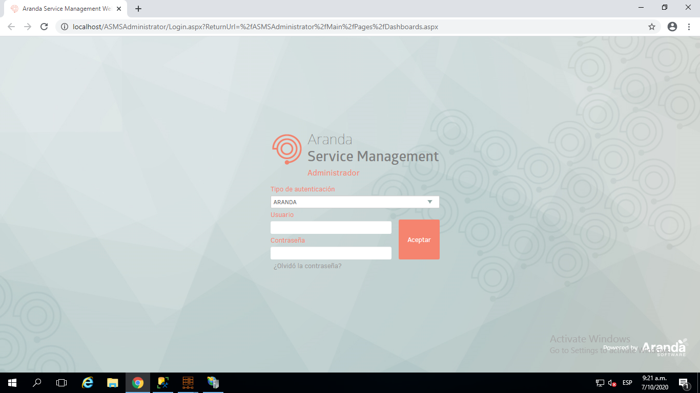

